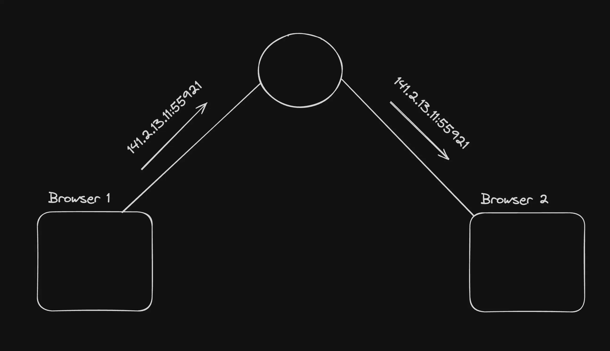

# WebRTC

WebRtc Is a Peer to peer connection protocol without a server by which computers can make a contact

1. A Streaming service can also use WebRTC but it will not , because they don’t need real time connection and also to stream in many qualities , they need something know as HLS
2. WebRTC is majorly used to make a real time connection with minimum latency

## Signaling server

A webRTC needs a signaling service or a backend to tell what are my IP or Ice candidates to make sure that both the peers know about each other and can connect with each other



## **Stun (Session Traversal Utilities for NAT)**

It gives you back your publically accessable IPs. It shows you how the world sees you

Check [https://webrtc.github.io/samples/src/content/peerconnection/trickle-ice/](https://webrtc.github.io/samples/src/content/peerconnection/trickle-ice/)

It is basically the ip of our computer , how the internet sees us


## **Ice candidates**

ICE (Interactive Connectivity Establishment) candidates are potential networking endpoints that WebRTC uses to establish a connection between peers. Each candidate represents a possible method for two devices (peers) to communicate, usually in the context of real-time applications like video calls, voice calls, or peer-to-peer data sharing.

If two friends are trying to connect to each other in a `hostel wifi` , then they can connect via their private router ice candidates.

If two people from different countries are trying to connect to each other, then they would connect via their public IPs.

## **Turn server**

A lot of times, your network doesn’t allow media to come in from `browser 2` . This depends on how restrictive your network is

Since the `ice candidate` is discovered by the `stun server`, your network `might` block incoming data from `browser 2` and only allow it from the `stun server`


## Offer

The process of the first browser (the one initiating connection) sending their `ice candidates` to the other side.

## Answer

The other side returning their `ice candidates` is called the answer.

## **SDP - Session description protocol**

A single file that contains all your

1. ice candidates
2. what media you want to send, what protocols you’ve used to encode the media

This is the file that is sent in the `offer` and received in the `answer`

```jsx
v=0
o=- 423904492236154649 2 IN IP4 127.0.0.1
s=-
t=0 0
m=audio 49170 RTP/AVP 0
c=IN IP4 192.168.1.101
a=rtpmap:0 PCMU/8000
a=ice-options:trickle
a=candidate:1 1 UDP 2122260223 192.168.1.101 49170 typ host
a=candidate:2 1 UDP 2122194687 10.0.1.1 49171 typ host
a=candidate:3 1 UDP 1685987071 93.184.216.34 49172 typ srflx raddr 10.0.1.1 rport 49171
a=candidate:4 1 UDP 41819902 10.1.1.1 3478 typ relay raddr 93.184.216.34 rport 49172/h2

```

## **RTCPeerConnection (pc, peer connection)**

[https://developer.mozilla.org/en-US/docs/Web/API/RTCPeerConnection](https://developer.mozilla.org/en-US/docs/Web/API/RTCPeerConnection)

This is a class that the browser provides you with which gives you access to the `sdp`, lets you create `answers` / `offers` , lets you send media.

This class hides all the complexity of webrtc from the developer

### **Summary**

You need a `signaling server`, `stun server` to initiate the webrtc conn b/w the parties. You can kill these once the conn is made.

You need to include a `turn server` incase any of the users are on a restrictive network so you can get back a `turn` ice candidate as well.

This is the most basic implementation of WebRTC used back in maybe 2010 or so. No there are many libraries such as a SFU which makes this thing more easy and handful

The most basic WebRTC connection is this

[https://github.com/garvittsingla/WebRTC/blob/main/README.md](https://github.com/garvittsingla/WebRTC/blob/main/README.md)


Demo : [https://jsfiddle.net/rainzhao/3L9sfsvf/](https://jsfiddle.net/rainzhao/3L9sfsvf/)